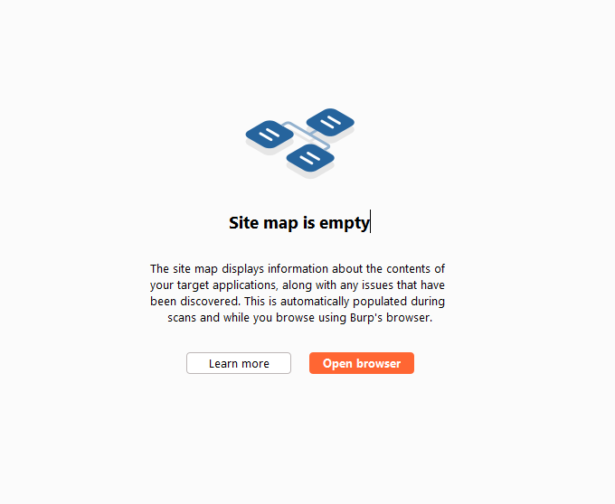

# ✅ Day 16: Fuzzing Advanced

Fuzzy Testing lebih dari sekedar Unit Testing. Kita juga dapat menggunakan metodologi ini untuk menguji aplikasi web kita dengan mengaburkan permintaan yang dikirim ke server kita atau dengan kata lain kita bisa menguji response web server kita dengan Fuzzy Testing ini.

Tools yang bisa digunakan seperti [Burp Intruder](https://portswigger.net/burp/documentation/desktop/tools/intruder) dan [SmartBear](https://smartbear.com/). Sayangnya kedua tools tersebut dibatasi yang artinya kita harus membeli lisensi untuk dapat menggunakannya secara full.

Hari ini kita akan belajar Fuzzing for vulnerabilities dengan menggunakan Burp Suite Community dan juga menggunakan Lab [https://portswigger.net/web-security/authentication/password-based/lab-username-enumeration-via-different-responses](https://portswigger.net/web-security/authentication/password-based/lab-username-enumeration-via-different-responses).

## Fuzzing for Vulnerabilities

### Example


Langkah-langkahnya sendiri sebetulnya sudah ada pada Lab, kalian bisa mengikuti langkah-langkah yang sudah disediakan atau langkah-langkah yang ditulis ulang dibawah ini.


1. Sebelum bisa menggunakan lab di atas, kita harus login/ daftar terlebih dahulu pada situ portswigger dan jangan lupa install terlebih dahulu Burp Suite Community.
2. Setelah mendapatkan akun, kita bisa memulai lab dengan menekan tombol ACCESS THE LAB pada Lab diatas.
3. Buka aplikasi Burp Suite Community.
4.  Pada halaman awal Burp Suite Community, pilih Open Browser.\

    <figure><figcaption></figcaption></figure>
5. Jika browser sudah terbuka, copy dan paste url dari Lab (https://xxxxxxxxxxxxxxxxxxxxxxxxxxxxx.web-security-academy.net/ )
6.  Lalu pilih My Account kemudian kalian coba login dengan username dan password random\

    <figure><figcaption></figcaption></figure>
7.  Jika sudah, kembali ke aplikasi Burp Suite Community. Kemudian cari `POST /login` kemudian klik kanan dan pilih Sent to Intruder\

    <figure><figcaption></figcaption></figure>
8.  Buka tab Intruder, di sini kita akan mengganti payload username & password dengan data dinamis untuk mengetahui response yang dikembalikan kepada kita. Pertama-tama kita ubah terlebih dahulu username dan biarkan password statis. Kita harus menambahkan terlebih dahulu `§` pada value username contohnya `username=§invalid-username§`\

    <figure><figcaption></figcaption></figure>
9.  Jika sudah mengubah payload, saatnya kita pindah ke menu Payloads. Biarkan pengaturan Payload sets default. \

    <figure><figcaption></figcaption></figure>
10. Pada payload settings kita Paste-kan username yang sudah disediakan pada lab atau pada [link ini](https://portswigger.net/web-security/authentication/auth-lab-usernames).
11. Jika sudah ditambahkan,  maka Payload count dan Request count akan menjadi 101 keduanya.\

    <figure><figcaption></figcaption></figure>
12. Kita lakukan Start Attack.  Ketika muncul windows baru, kalian perhatikan status dan response yang diterima. Nanti kalian akan menemukan username mana yang benar.\

    <figure><figcaption></figcaption></figure>
13. Setelah menemukan username yang benar, saatnya kita mencari passowrd yang benar. Lakukan hal yang sama untuk password mulai dari step 8 sampai step 12 yang dimana pada step 8 kita balik username menjadi statis (sesuai hasil dari step 12) dan password menjadi dinamis.
14. Ketika kita sudah menemukan username dan password yang sesuai, terakhir kita coba login pada websitenya secara langsung.

## httpFuzz&#x20;

Salah satu tools open-source yang terinspirasi dari Burp Intruder yaitu [https://github.com/JonCooperWorks/httpfuzz](https://github.com/JonCooperWorks/httpfuzz), kalian bisa lihat informasi dan tutorialnya pada situs berikut [https://joncooperworks.com/hacking-http-with-httpfuzz-1](https://joncooperworks.com/hacking-http-with-httpfuzz-1)

## Resources

* [https://owasp.org/www-community/Fuzzing](https://owasp.org/www-community/Fuzzing)
* [https://portswigger.net/burp/documentation/desktop/tools/intruder/uses/fuzzing](https://portswigger.net/burp/documentation/desktop/tools/intruder/uses/fuzzing)
* [https://portswigger.net/burp/documentation/desktop/testing-workflow/analyzing/supported-http-methods](https://portswigger.net/burp/documentation/desktop/testing-workflow/analyzing/supported-http-methods)
